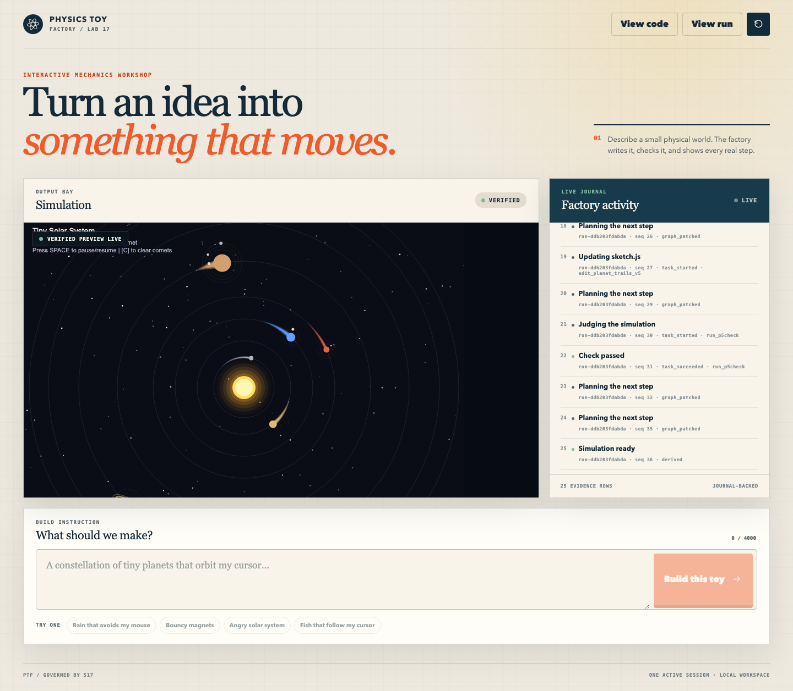

# Physics Toy Factory

Physics Toy Factory turns a plain-language wish — "bouncy magnets", "rain that avoids my mouse" —
into a running p5.js toy you can play with in the browser. You describe the toy; an S17Code agent
writes `sketch.js` inside a dedicated, hash-validated scratch workspace; a server-side Node checker
must pass on the result; and only then does the browser receive an interactive preview.

The product owns the trusted p5.js fixture, the smoke checker, the workspace lifecycle, the API, and
the UI. It never runs the model itself: all agent work happens in the sibling S17Code engine, which
this product drives over a private control API with a narrow, per-run authority list.

## What it looks like



That is a real captured frame from the 2026-08-16 live qualification — a solar system created from a
prompt, then modified by a linked follow-up to leave glowing trails — not a mockup. It is retained
with its run graphs under `docs/evidence/phase6/full-requalification-2026-08-16/`.

## How it works

1. **You send a prompt.** The product validates it against `PTF_MAX_PROMPT_CHARS` and embeds it as
   delimited, untrusted data inside a fixed goal template (`prompts.py`). Browser text is never
   treated as instructions to the product.
2. **The product starts one S17 run** with an explicit authority list — `create_file`, `edit_code`,
   `run_command` for a creation; only `edit_code` and `run_command` for a follow-up. The browser
   never chooses the workspace, the upstream URL, or the authority.
3. **The agent writes `sketch.js`** in the validated workspace and runs the checker itself:
   `node p5check.js sketch.js`. The checker executes the sketch in a Node `vm` with a 100 ms
   timeout, drives five `draw()` frames, and rejects network, storage, DOM, and dynamic-code access
   as well as unsupported or misspelled p5 APIs. A red checker result is normal — the agent reads
   the bounded error evidence and repairs its own code.
4. **The product classifies the finished run** with `classify_graph` in `orchestrator.py`. A run is
   ready only if it finished, contains a succeeded `answer_with_evidence` node, and its *latest*
   node whose command normalizes to exactly `node p5check.js sketch.js` did not time out and exited
   `0`. Anything ambiguous fails closed.
5. **A ready run yields a preview lease** bound to the SHA-256 of the verified sketch bytes. The
   browser mounts a sandboxed iframe that loads the trusted shell, the vendored p5.js, and the
   sketch — each fetched only with the correct revision hash and a server-issued preview ID.
6. **The toy becomes interactive** once the shell reports two animation frames. If it does not
   report in time, the readiness watchdog destroys the frame.

## Prerequisites

- Python 3.12 or newer
- [`uv`](https://docs.astral.sh/uv/)
- Node.js 20 or newer available as `node`
- Playwright Chromium, for the browser test journeys
- Docker, to run generated code in the pinned non-root container image

Node is an external runtime prerequisite. There is intentionally no npm project, JavaScript package
manager, frontend build, or runtime CDN dependency.

## Setup

```bash
cp .env.example .env
uv sync --locked --dev
uv run playwright install chromium
uv run physics-toy-factory
```

The server binds to `127.0.0.1:8120` by default. On first startup the app copies its immutable seed
to `PTF_WORKSPACE`, initializes that directory as a dedicated Git repository, and records the base
fixture as the tag `physics-toy-base-v1`. That tag is what reset returns to. Start the S17 service
with the launch profile below before creating a run.

## Configuration

All configuration is read once, at startup, into a frozen `Settings` object (`config.py`) that is
injected into the services. `load_settings()` reads `.env` first and then overlays the process
environment; unknown keys are rejected.

| Variable | Default | Controls |
| --- | --- | --- |
| `PTF_S17_CONTROL_TOKEN` | **required** | Bearer token for the S17 control API. Never sent to the browser. |
| `PTF_WORKSPACE` | **required** | Absolute path of the dedicated scratch workspace the agent edits. |
| `PTF_ARTIFACT_DIR` | **required** | Absolute path holding `history.sqlite3` and published artifacts. |
| `PTF_HOST` | `127.0.0.1` | Bind address. |
| `PTF_PORT` | `8120` | Bind port. |
| `PTF_S17_BASE_URL` | `http://127.0.0.1:8113` | Base URL of the S17 control plane. |
| `PTF_S17_RUN_BUDGET_USD` | `0.50` | Per-run cost ceiling sent to S17 with every run. |
| `PTF_MAX_PROMPT_CHARS` | `4000` | Maximum accepted prompt length, for creation and follow-up. |
| `PTF_HTTP_CONNECT_TIMEOUT_SECONDS` | `3` | Connect/write/pool timeout for calls to S17. |
| `PTF_HTTP_READ_TIMEOUT_SECONDS` | `30` | Read timeout for non-streaming S17 calls. |
| `PTF_PREVIEW_READY_TIMEOUT_SECONDS` | `8` | How long the browser waits for the preview to report ready before the watchdog destroys the frame. |
| `PTF_MAX_SKETCH_BYTES` | `100000` | Upper bound on `sketch.js`, enforced on disk and on archived history bytes. |
| `S17_EXEC_CONTAINER` | `0` | Reporting only — see below. |
| `S17_EXEC_IMAGE` | unset | Reporting only — see below. |

The product refuses to start rather than run in an unsafe shape. Validation fails if the token is
empty or still the `.env.example` placeholder, if `PTF_HOST` is not a loopback address, if either
path is relative, if `PTF_WORKSPACE` and `PTF_ARTIFACT_DIR` are the same tree or nested inside one
another, or if container mode is on without a pinned, non-`:latest` image.

`S17_EXEC_CONTAINER` and `S17_EXEC_IMAGE` are the S17 engine's own settings. Exposing them to the
product process only lets `/api/health` report the configured execution mode; the product never
verifies that the container runtime is actually present, and `secure_sandbox_claimed` in that
response is always `false`.

## Running the S17 engine

The interactive product path needs an S17Code process pointed at the exact same real workspace path,
started with this product-specific profile:

```text
S17_CONTROL_TOKEN=<same private value as PTF_S17_CONTROL_TOKEN>
S17_SANDBOX_ROOT=
S17_SKILLS_DIR=
S17_WORKSPACE=<exact real path of PTF_WORKSPACE>
S17_ALLOWED_COMMANDS=node
S17_PROTECTED_PATHS=.physics-toy-workspace,P5_API.md,p5check.js,shell/**,tests/**,test/**,**/tests/**,**/test_*.py,**/*_test.py,conftest.py,**/conftest.py,pytest.ini,tox.ini,setup.cfg,pyproject.toml,.github/**
S17_MAX_REPEAT_FAILURES=3
S17_EXEC_CONTAINER=1
S17_EXEC_IMAGE=<pinned non-root Node image>
```

Keep the sandbox and skills variables present but empty. S17 loads its repository `.env` on import;
unsetting them would let dotenv restore generic capabilities outside the product workspace profile.

`containers/phase6-node.Dockerfile` is the digest-pinned, non-root Node image used to execute
generated code. For a full hand-driven bring-up of the three-process topology, see
[`docs/MANUAL_TESTING.md`](docs/MANUAL_TESTING.md).

## Using it

The UI offers four suggested prompts — **Rain that avoids my mouse**, **Bouncy magnets**, **Angry
solar system**, **Fish that follow my cursor** — or you can write your own.

- **Watch the work.** Activity streams live over SSE: planning, file writes, each checker attempt
  and its result, and the final answer. A failed checker followed by a repair is the normal shape of
  a run, and the journal shows it rather than hiding it.
- **One linked follow-up.** After a successful run you may ask for exactly one modification. It runs
  with edit-only authority against the existing sketch, and the new verified revision replaces the
  old preview. A second follow-up is refused without starting a run.
- **Saved runs.** Accepted runs, their graphs, and their verified sketch bytes are stored in
  `PTF_ARTIFACT_DIR/history.sqlite3`. The saved-run library reopens any run's evidence, code, and
  verified preview read-only, with search, paging, and delete. Archived bytes are re-checked against
  their recorded length and hash on every read.
- **Restart safety.** The current session is restored on restart and can reconnect only to its own
  previously accepted S17 run. Runs created before the catalog existed are not imported.
- **Reset** returns the workspace to the `physics-toy-base-v1` tag and starts a new session. It is
  refused while a run is active, and it does not delete saved runs.

## HTTP API

| Method and path | Purpose |
| --- | --- |
| `GET /` | The workshop UI. |
| `GET /static/*` | UI assets. |
| `GET /api/health` | Workspace verification, S17 process and gateway probes, configured execution mode. |
| `GET /api/session` | Current session, suggested prompts, and any degraded upstream state. |
| `POST /api/session/reset` | Reset the workspace and start a new session. |
| `POST /api/runs` | Start a creation run. |
| `POST /api/runs/follow-up` | Start the one linked modification run. |
| `GET /api/runs/{session-owned-run-id}` | The raw run graph, with terminal state folded in. |
| `GET /api/runs/{session-owned-run-id}/events` | SSE activity stream; honours `Last-Event-ID`. |
| `POST /api/runs/{session-owned-run-id}/browser-error` | Record a browser-side preview failure. |
| `GET /api/history?limit={1..100}&cursor={opaque}&q={search}` | Page the saved-run catalog. |
| `GET /api/history/{product-history-id}` | One saved run's detail and graph. |
| `GET /api/history/{product-history-id}/code` | The archived, hash-checked sketch source. |
| `POST /api/history/{product-history-id}/preview` | Lease a read-only preview of a saved run. |
| `DELETE /api/history/{product-history-id}` | Delete a saved run that is not the current one. |
| `GET /api/code` | The current verified sketch source. |
| `POST /api/preview` | Lease a preview for a verified revision hash. |
| `GET /preview/{verified-sha256}?preview_id={server-issued-id}` | The trusted iframe shell for the current revision. |
| `GET /history-preview/{product-history-id}?preview_id={server-issued-id}` | The trusted iframe shell for a saved run. |
| `GET /api/preview/p5.min.js?revision={verified-sha256}&preview_id={server-issued-id}` | Vendored p5.js for the current preview. |
| `GET /api/preview/sketch.js?revision={verified-sha256}&preview_id={server-issued-id}` | Verified sketch bytes for the current preview. |
| `GET /api/history/{product-history-id}/preview/p5.min.js?preview_id={server-issued-id}` | Vendored p5.js for a saved-run preview. |
| `GET /api/history/{product-history-id}/preview/sketch.js?preview_id={server-issued-id}` | Archived sketch bytes for a saved-run preview. |

The browser never supplies a filesystem path, an upstream URL, or an arbitrary run ID, and it never
receives the S17 control token. Every failure returns the same envelope:
`{"error": {"code": ..., "message": ..., "retryable": ...}}`.

## Security model

Generated `sketch.js` is untrusted. Everything else — the seed workspace, `trusted_assets.json`, the
checker, the marker, the shell, the tests, and the packaging — is trusted product code.

- **The workspace proves its identity before it is used.** Before any start, reset, code read, or
  preview, the product validates the absolute real path, the marker file, the Git repository, the
  base tag, and the SHA-256 and size of every trusted asset. It refuses source-repository roots,
  `$HOME`, the filesystem root, symlinked components, and tampered fixtures. Subprocesses run
  without a shell, with the validated workspace as an explicit `cwd`.
- **Previews are caged.** Each preview response carries a strict per-response CSP with a fresh
  nonce (`default-src 'none'`, `connect-src 'none'`), `Referrer-Policy: no-referrer`,
  `Cache-Control: no-store`, `X-Content-Type-Options: nosniff`, and a `Permissions-Policy` denying
  camera, microphone, geolocation, display capture, payment, and USB. The iframe is created only
  for the current verified hash and carries exactly `sandbox="allow-scripts"`. Messages from the
  wrong window or with the wrong preview ID are ignored.
- **p5.js is vendored, never fetched.** Version 2.3.1 (LGPL-2.1) is served from the validated
  workspace copy with its license and third-party notices, and its hash is recorded in
  `trusted_assets.json`. No runtime CDN is used anywhere.
- **Untrusted content is rendered as text**, never as HTML — prompts, agent output, checker
  evidence, and browser error reports alike.
- **Node `vm` is defense in depth, not an OS sandbox.** It bounds accidents, not attacks. Executing
  live generated code safely requires S17's pinned, non-root, no-network container execution. If
  that is not available, the system is development-only for trusted prompts and must not be
  described as securely sandboxed. The product reports its configured mode and never claims more.

## Testing

There is no CI in this repository — no `.github/` directory exists, and every gate below is run by
hand.

```bash
uv sync --locked --dev
uv run ruff check .
uv run pytest -q -m "not browser"
uv run pytest -q -m browser
```

The deterministic suite needs no network and no model call: it drives an in-process fake S17 ASGI
service with recorded graph and SSE fixtures. It covers configuration validation, workspace identity
and reset, the S17 client contract, readiness classification, the HTTP API including history and
restart durability, the qualification tooling, and the checker itself.

Browser journeys are Playwright-driven against the real product surface and the fake S17, and are
split by marker:

| Selection | Journey |
| --- | --- |
| `uv run pytest -q -m "browser and activity"` | Recorded red-to-green activity, run evidence and degraded shapes, safe dialogs, reconnect snapshot deduplication, honest terminal failure. |
| `uv run pytest -q -m "browser and preview"` | The verified-preview cage rejecting hostile capabilities, the watchdog destroying an unresponsive frame, and the saved-run library reopening evidence, code, and preview before deleting safely. |
| `uv run pytest -q -m "browser and follow_up"` | One linked follow-up replacing the preview after a read, an anchored edit, and a passing checker. |

Chromium installation is explicit and is never performed by the test suite. If Node is absent, the
checker tests report an explicit skip for local diagnosis; such a skip is diagnostic only and never
counts as a passing gate.

## Live qualification and evidence

Deterministic tests prove the product's own logic. They cannot prove that a real model, on a real
budget, in a real container, produces a working toy — that requires live qualification, which is
deliberately kept separate.

Live qualification passed on 2026-08-16. All four suggested prompts, the two-step solar-system demo,
and its linked glowing-trails follow-up reached verified ready previews with passing container
checkers, with no retries, and the final linked preview was confirmed by real-browser observation.
Runs carry the validated `PTF_S17_RUN_BUDGET_USD` ceiling and a stable demo principal, which keeps
them on S17's configured, metered model ladder rather than its unbudgeted gateway default.

**One limitation is open:** the full six-run suite has not been rerun since the S17Code and gateway
revisions were re-pinned. Only a single-creation canary has passed at the current pins; the passing
full suite belongs to the superseded ones.

- [`docs/PHASE6_RUNBOOK.md`](docs/PHASE6_RUNBOOK.md) — the reproducible qualification procedure:
  pinned revisions, the container profile, the exact scripted runs, and the evidence review. The
  tooling fails if a run does not converge, and never turns a first-attempt pass or a fabricated
  event into repair evidence.
- [`docs/MANUAL_TESTING.md`](docs/MANUAL_TESTING.md) — hand-driven bring-up for demonstration,
  exploration, or diagnosis. A hand-driven run produces no sanitized graph, hash set, or reviewed
  summary, and is never publishable evidence.
- [`docs/evidence/phase6/EVIDENCE.md`](docs/evidence/phase6/EVIDENCE.md) — the full append-only
  record, including the earlier failed qualification, which is preserved rather than overwritten.

## Scope

This repository is the standalone product. Engine mechanics belong to the sibling `S17Code`
repository.

The product deliberately does not include automatic browser-error repair, a Surprise Me generator,
skill A/B comparison, planted-refusal demonstrations, persistent multi-user sessions, or more than
one follow-up per run. A failure that occurs only in the browser stays display-only and never starts
another S17 run.
