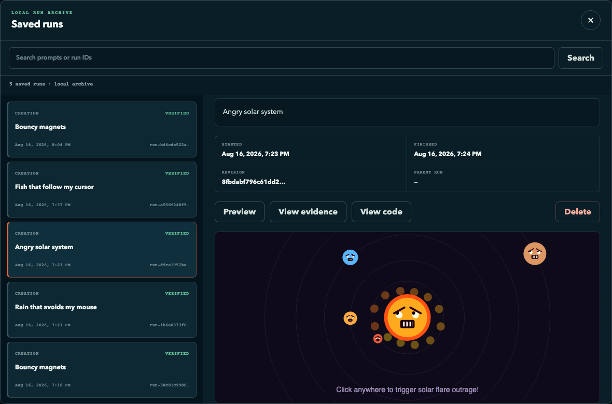
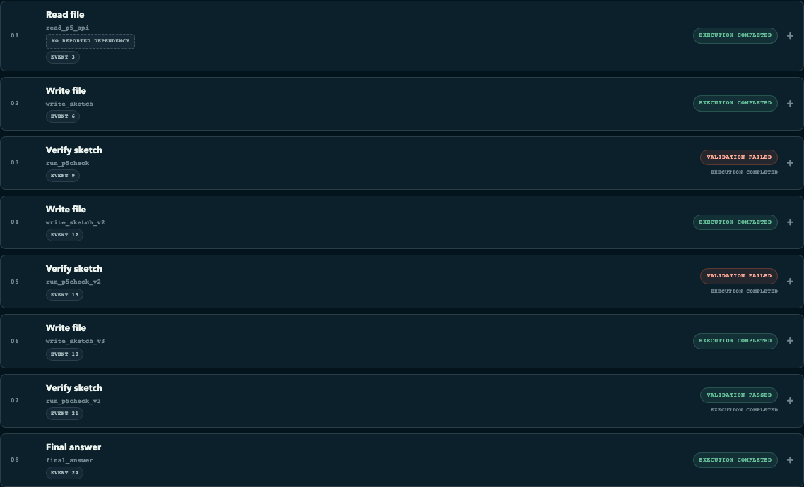

# Physics Toy Factory

Physics Toy Factory turns a plain-language wish — "bouncy magnets", "rain that avoids my mouse" —
into a running p5.js toy you can play with in the browser. You describe the toy; an S17Code agent
writes `sketch.js` inside a dedicated, hash-validated scratch workspace; a server-side Node checker
must pass on the result; and only then does the browser receive an interactive preview.

> **Session 17, Assignment Part 1.** This is the `Lovable / v0 / bolt.new` option — type a thing,
> watch it get built, see it running in the preview pane — applied to physics toys instead of web
> apps. The engine is [S17Code](https://github.com/theschoolofai/S17Code); the product, the
> frontend, the checker, and every refusal in it are this repository.

The product never runs a model itself. All agent work happens in S17Code, which this product drives
over a private control API with a narrow, per-run authority list.

## What it looks like



A real saved run, reopened from the local archive. The prompt was "Angry solar system"; the agent
decided on its own that the planets should have faces and that clicking should trigger a solar
flare. Nothing on that canvas was written by a human.

## Watch the run

The lesson is blunt that legibility is the point: *"The run has to be visible… it is worth more than
your CSS."* So the product shows every step the agent actually took, read back from the real S17
graph. There are no simulated progress messages anywhere in the UI.



That is one real run for "Bouncy magnets", and it is the shape worth looking at:

```text
01  read_p5_api      read the allowed p5 surface
02  write_sketch     first attempt
03  run_p5check      VALIDATION FAILED     ← the agent failed itself
04  write_sketch_v2  repair
05  run_p5check_v2   VALIDATION FAILED     ← and again
06  write_sketch_v3  repair
07  run_p5check_v3   VALIDATION PASSED
08  final_answer
```

Nobody told it to run the checker. It was told a checker existed. **Two red results, then green** —
and only that green result can reach the preview cage. Expand any step to read the bounded evidence
the agent read.

## Quickstart

Three processes: the gateway holds the keys, S17Code runs the loop, and this product is the
frontend. S17 holds no credential, and the browser never receives one either.

> **Runs cost real money.** The planner is a live frontier model and there is no offline or dry-run
> mode for the product path. Each run is capped by `PTF_S17_RUN_BUDGET_USD` (default `$0.50`); a
> typical creation spends `$0.03`–`$0.07`.

### Prerequisites

All of these must be true before anything starts. Each has a check — run them all, because two of
these failures do not surface until a run is already underway.

| Requirement | Check | Expected |
| --- | --- | --- |
| Python 3.12+ and [`uv`](https://docs.astral.sh/uv/) | `uv --version` | a version |
| Docker daemon running | `docker info --format '{{.ServerVersion}}'` | a version, no error |
| Docker socket path | `docker context inspect --format '{{.Endpoints.docker.Host}}'` | a `unix://…` path — keep it, step 4 needs it |
| Node.js 20+ as `node` | `node --version` | `v20` or newer |
| **Ollama serving `nomic-embed-text`** | `curl -sS http://127.0.0.1:11434/api/tags` | JSON listing `nomic-embed-text` |
| **Provider credentials in `glc_v5/.env`** | `grep -c API_KEY glc_v5/.env` | at least one |
| Playwright Chromium (browser tests only) | `uv run playwright install chromium` | installs or confirms |

Ollama is not optional and its absence is the easiest failure here to misdiagnose: `s17code` builds
its embedder unconditionally with no fallback, so the planner appears to work and the run then dies
at the final step. This repository holds no provider credentials by design — the gateway owns them
all.

There is deliberately no npm project, JavaScript package manager, frontend build, or runtime CDN
dependency.

```bash
git clone https://github.com/theschoolofai/glc_v5.git
git clone https://github.com/theschoolofai/S17Code.git
git clone https://github.com/gadekar-pravin/PhysicsToyFactory.git
```

**1. Gateway — port 8111**

```bash
cd glc_v5 && uv sync
set -a; source .env; set +a
export GLC_GATEWAY_DB="$PWD/.gateway.sqlite"
uv run glc serve
```

Give the gateway its own database. Sharing the default `~/.glc/gateway.sqlite` with an older GLC
generation makes it start healthy and then fail every model call at insert time, because that file's
`calls` table carries a `CHECK` constraint glc_v5 never writes. Do not migrate or delete that file —
it is an audit ledger.

**2. Build the checker image** (from this repository; digest-pinned and non-root)

```bash
docker build -f containers/phase6-node.Dockerfile -t physics-toy-factory-node:22.20.0-phase6 .
docker run --rm physics-toy-factory-node:22.20.0-phase6 id -u   # expect 1000, not 0
```

**3. Product — port 8120.** Start this *before* S17: on first boot it copies its immutable seed into
`PTF_WORKSPACE`, git-inits it, and tags `physics-toy-base-v1` — the tag reset returns to. S17
refuses to open a workspace directory that does not exist yet, so the reverse order cannot work the
first time. After that first boot, order no longer matters.

```bash
cd PhysicsToyFactory
cp .env.example .env          # then set the token and both absolute paths
uv sync --locked --dev
uv run physics-toy-factory
```

**4. Engine — port 8113.** Start S17Code with this product-specific profile. The profile *is* the
security boundary, so do not relax it:

```text
S17_CONTROL_TOKEN=<a long random token, the same value as PTF_S17_CONTROL_TOKEN>
S17_SANDBOX_ROOT=
S17_SKILLS_DIR=
S17_WORKSPACE=<exact real path of PTF_WORKSPACE>
S17_ALLOWED_COMMANDS=node
S17_PROTECTED_PATHS=.physics-toy-workspace,P5_API.md,p5check.js,shell/**,tests/**,test/**,**/tests/**,**/test_*.py,**/*_test.py,conftest.py,**/conftest.py,pytest.ini,tox.ini,setup.cfg,pyproject.toml,.github/**
S17_MAX_REPEAT_FAILURES=3
S17_EXEC_CONTAINER=1
S17_EXEC_IMAGE=physics-toy-factory-node:22.20.0-phase6
DOCKER_HOST=<the unix:// path from the prerequisite check>
```

```bash
cd S17Code && uv sync && uv run s17code serve
```

Three of these are easy to get wrong:

- **`S17_WORKSPACE` must equal `PTF_WORKSPACE` exactly.** They are one directory shared by two
  processes; a different path is a silently broken run, not an error.
- **Keep `S17_SANDBOX_ROOT` and `S17_SKILLS_DIR` present but empty.** S17 loads its repository `.env`
  on import and dotenv never overrides an already-set variable, so an empty-but-present value wins
  while an unset one gets repopulated — handing the planner generic capabilities outside this
  profile.
- **`DOCKER_HOST` is required whenever the daemon is not on `/var/run/docker.sock`**, which is the
  normal case for Docker Desktop on macOS. The checker runs with a scrubbed environment that
  forwards it only if already set; without it every check exits `125`.

**5. Confirm the whole topology before typing a prompt**

```bash
curl -sS http://127.0.0.1:8111/healthz          # gateway process
curl -sS http://127.0.0.1:8111/v1/providers     # gateway can actually route
curl -sS http://127.0.0.1:8113/healthz          # S17 process
curl -sS http://127.0.0.1:8113/readyz           # S17 -> gateway
curl -sS http://127.0.0.1:8120/api/health       # the product's own view
```

From the product, expect `"status": "ok"` with `workspace.verified: true` and both `s17.process.up`
and `s17.gateway.ready` true. If any of those is false the UI says so and refuses to start a run
rather than failing halfway through one.

Running all three on relocated ports, or diagnosing a bring-up, is covered step by step in
[`docs/MANUAL_TESTING.md`](docs/MANUAL_TESTING.md).

## How it works

1. **You send a prompt.** It is validated against `PTF_MAX_PROMPT_CHARS` and embedded as delimited,
   untrusted data inside a fixed goal template (`prompts.py`). Browser text is never treated as
   instructions to the product.
2. **The product starts one S17 run** with an explicit authority list — `create_file`, `edit_code`,
   `run_command` for a creation; only `edit_code` and `run_command` for a follow-up. The browser
   never chooses the workspace, the upstream URL, or the authority.
3. **The agent writes `sketch.js`** and runs the checker itself: `node p5check.js sketch.js`. The
   checker executes the sketch in a Node `vm` with a 100 ms timeout, drives five `draw()` frames,
   and rejects network, storage, DOM, and dynamic-code access as well as unsupported or misspelled
   p5 APIs.
4. **The product classifies the finished run** with `classify_graph` in `orchestrator.py`. A run is
   ready only if it finished, contains a succeeded `answer_with_evidence` node, and its *latest*
   node whose command normalizes to exactly `node p5check.js sketch.js` did not time out and exited
   `0`. Anything ambiguous fails closed.
5. **A ready run yields a preview lease** bound to the SHA-256 of the verified sketch bytes. The
   browser mounts a sandboxed iframe that loads the trusted shell, the vendored p5.js, and the
   sketch — each fetched only with the correct revision hash and a server-issued preview ID.
6. **The toy becomes interactive** once the shell reports two animation frames. If it does not
   report in time, the readiness watchdog destroys the frame.

## Watch it fail

Every clone looks good on the happy path, so here is where to look for this one's failures. All of
these are real, reachable states, and most are pinned by tests.

| Failure | What you see |
| --- | --- |
| **The checker rejects the agent's code** | The red-to-green chain above. Normal, and the run still succeeds. |
| **The agent never converges** | The run finishes without a passing latest checker, `classify_graph` returns `checker_failed`, and no preview is offered. There is no "nearly worked" state. |
| **The toy breaks in your browser only** | The shell reports the error, it is recorded against the run and shown as text — and no repair run is started. A browser-only failure is display-only by design. |
| **The toy never starts drawing** | The watchdog destroys the iframe after `PTF_PREVIEW_READY_TIMEOUT_SECONDS` and says so. |
| **S17 or the gateway is down** | `/api/health` reports `degraded`, the UI shows an explicit banner, and run creation is disabled instead of timing out. |
| **You ask for a second follow-up** | HTTP 409, refused before any S17 run starts. |
| **You reset mid-run** | HTTP 409. Reset is refused while a run is active. |
| **The workspace has been tampered with** | Fixture hashes fail validation and the product refuses to start, reset, read code, or preview. |

Two failures are kept as artifacts rather than described:

- [`docs/evidence/phase6/repair-proof/`](docs/evidence/phase6/repair-proof/) — a genuine live
  red-to-green repair: a deliberately broken sketch installed, the checker failing at sequence 5,
  one anchored edit, and the checker passing at sequence 13. The tooling that produced it fails
  closed; it will not accept a first-attempt pass as repair evidence.
- [`docs/evidence/phase6/live-qualification/`](docs/evidence/phase6/live-qualification/) — the
  **failed** first qualification of 2026-08-15. All five creations finished without
  `answer_with_evidence`, the follow-up was refused with HTTP 409, and no preview was ever
  verified. It is preserved rather than overwritten.

## Using it

The UI offers four suggested prompts — **Rain that avoids my mouse**, **Bouncy magnets**, **Angry
solar system**, **Fish that follow my cursor** — or you can write your own.

- **One linked follow-up.** After a successful run you may ask for exactly one modification. It runs
  with edit-only authority against the existing sketch, and the new verified revision replaces the
  old preview.
- **Saved runs.** Accepted runs, their graphs, and their verified sketch bytes are stored in
  `PTF_ARTIFACT_DIR/history.sqlite3`. The archive reopens any run's evidence, code, and verified
  preview read-only, with search, paging, and delete. Archived bytes are re-checked against their
  recorded length and hash on every read.
- **Restart safety.** The current session is restored on restart and can reconnect only to its own
  previously accepted S17 run.
- **Reset** returns the workspace to the `physics-toy-base-v1` tag and starts a new session. It does
  not delete saved runs.

## Configuration

All configuration is read once, at startup, into a frozen `Settings` object (`config.py`) that is
injected into the services. `load_settings()` reads `.env` first and then overlays the process
environment; unknown keys are rejected.

| Variable | Default | Controls |
| --- | --- | --- |
| `PTF_S17_CONTROL_TOKEN` | **required** | Bearer token for the S17 control API. Never sent to the browser. |
| `PTF_WORKSPACE` | **required** | Absolute path of the dedicated scratch workspace the agent edits. |
| `PTF_ARTIFACT_DIR` | **required** | Absolute path holding `history.sqlite3` and published artifacts. |
| `PTF_HOST` | `127.0.0.1` | Bind address. |
| `PTF_PORT` | `8120` | Bind port. |
| `PTF_S17_BASE_URL` | `http://127.0.0.1:8113` | Base URL of the S17 control plane. |
| `PTF_S17_RUN_BUDGET_USD` | `0.50` | Per-run cost ceiling sent to S17 with every run. |
| `PTF_MAX_PROMPT_CHARS` | `4000` | Maximum accepted prompt length, for creation and follow-up. |
| `PTF_HTTP_CONNECT_TIMEOUT_SECONDS` | `3` | Connect/write/pool timeout for calls to S17. |
| `PTF_HTTP_READ_TIMEOUT_SECONDS` | `30` | Read timeout for non-streaming S17 calls. |
| `PTF_PREVIEW_READY_TIMEOUT_SECONDS` | `8` | How long the browser waits for the preview to report ready before the watchdog destroys the frame. |
| `PTF_MAX_SKETCH_BYTES` | `100000` | Upper bound on `sketch.js`, enforced on disk and on archived history bytes. |
| `S17_EXEC_CONTAINER` | `0` | Reporting only — see below. |
| `S17_EXEC_IMAGE` | unset | Reporting only — see below. |

The product refuses to start rather than run in an unsafe shape. Validation fails if the token is
empty or still the `.env.example` placeholder, if `PTF_HOST` is not a loopback address, if either
path is relative, if `PTF_WORKSPACE` and `PTF_ARTIFACT_DIR` are the same tree or nested inside one
another, or if container mode is on without a pinned, non-`:latest` image.

`S17_EXEC_CONTAINER` and `S17_EXEC_IMAGE` are the S17 engine's own settings. Exposing them to the
product process only lets `/api/health` report the configured execution mode; the product never
verifies that the container runtime is actually present, and `secure_sandbox_claimed` in that
response is always `false`.

## HTTP API

What the browser may call:

| Method and path | Purpose |
| --- | --- |
| `GET /` | The workshop UI. |
| `GET /static/*` | UI assets. |
| `GET /api/health` | Workspace verification, S17 process and gateway probes, configured execution mode. |
| `GET /api/session` | Current session, suggested prompts, and any degraded upstream state. |
| `POST /api/session/reset` | Reset the workspace and start a new session. |
| `POST /api/runs` | Start a creation run. |
| `POST /api/runs/follow-up` | Start the one linked modification run. |
| `GET /api/runs/{session-owned-run-id}` | The raw run graph, with terminal state folded in. |
| `GET /api/runs/{session-owned-run-id}/events` | SSE activity stream; honours `Last-Event-ID`. |
| `POST /api/runs/{session-owned-run-id}/browser-error` | Record a browser-side preview failure. |
| `GET /api/history?limit={1..100}&cursor={opaque}&q={search}` | Page the saved-run catalog. |
| `GET /api/history/{product-history-id}` | One saved run's detail and graph. |
| `GET /api/history/{product-history-id}/code` | The archived, hash-checked sketch source. |
| `POST /api/history/{product-history-id}/preview` | Lease a read-only preview of a saved run. |
| `DELETE /api/history/{product-history-id}` | Delete a saved run that is not the current one. |
| `GET /api/code` | The current verified sketch source. |
| `POST /api/preview` | Lease a preview for a verified revision hash. |
| `GET /preview/{verified-sha256}?preview_id={server-issued-id}` | The trusted iframe shell for the current revision. |
| `GET /history-preview/{product-history-id}?preview_id={server-issued-id}` | The trusted iframe shell for a saved run. |
| `GET /api/preview/p5.min.js?revision={verified-sha256}&preview_id={server-issued-id}` | Vendored p5.js for the current preview. |
| `GET /api/preview/sketch.js?revision={verified-sha256}&preview_id={server-issued-id}` | Verified sketch bytes for the current preview. |
| `GET /api/history/{product-history-id}/preview/p5.min.js?preview_id={server-issued-id}` | Vendored p5.js for a saved-run preview. |
| `GET /api/history/{product-history-id}/preview/sketch.js?preview_id={server-issued-id}` | Archived sketch bytes for a saved-run preview. |

The browser never supplies a filesystem path, an upstream URL, or an arbitrary run ID, and it never
receives the S17 control token. Every failure returns the same envelope:
`{"error": {"code": ..., "message": ..., "retryable": ...}}`.

What the product calls upstream, from `s17_client.py` — the whole of its dependency on the engine:

| S17 endpoint | Use |
| --- | --- |
| `POST /v1/agent/runs/async` | Start a run with the goal, the authority list, the budget ceiling, and a stable demo principal. |
| `GET /v1/agent/runs/{id}` | Poll the raw graph. |
| `GET /v1/runs/{id}/events` | Stream events, re-emitted to the browser as SSE. |
| `GET /healthz`, `GET /readyz` | Probe the engine and gateway for `/api/health`. |

## Security model

Generated `sketch.js` is untrusted. Everything else — the seed workspace, `trusted_assets.json`, the
checker, the marker, the shell, the tests, and the packaging — is trusted product code.

- **The workspace proves its identity before it is used.** Before any start, reset, code read, or
  preview, the product validates the absolute real path, the marker file, the Git repository, the
  base tag, and the SHA-256 and size of every trusted asset. It refuses source-repository roots,
  `$HOME`, the filesystem root, symlinked components, and tampered fixtures. Subprocesses run
  without a shell, with the validated workspace as an explicit `cwd`.
- **Previews are caged.** Each preview response carries a strict per-response CSP with a fresh nonce
  (`default-src 'none'`, `connect-src 'none'`), `Referrer-Policy: no-referrer`,
  `Cache-Control: no-store`, `X-Content-Type-Options: nosniff`, and a `Permissions-Policy` denying
  camera, microphone, geolocation, display capture, payment, and USB. The iframe is created only for
  the current verified hash and carries exactly `sandbox="allow-scripts"`. Messages from the wrong
  window or with the wrong preview ID are ignored.
- **p5.js is vendored, never fetched.** Version 2.3.1 (LGPL-2.1) is served from the validated
  workspace copy with its license and third-party notices, and its hash is recorded in
  `trusted_assets.json`. No runtime CDN is used anywhere.
- **Untrusted content is rendered as text**, never as HTML — prompts, agent output, checker
  evidence, and browser error reports alike.
- **Node `vm` is defense in depth, not an OS sandbox.** It bounds accidents, not attacks. Executing
  live generated code safely requires S17's pinned, non-root, no-network container execution. If
  that is not available, the system is development-only for trusted prompts and must not be
  described as securely sandboxed. The product reports its configured mode and never claims more.

## Testing

There is no CI in this repository — no `.github/` directory exists, and every gate below is run by
hand.

```bash
uv sync --locked --dev
uv run ruff check .
uv run pytest -q -m "not browser"
uv run pytest -q -m browser
```

The deterministic suite needs no network and no model call: it drives an in-process fake S17 ASGI
service with recorded graph and SSE fixtures. It covers configuration validation, workspace identity
and reset, the S17 client contract, readiness classification, the HTTP API including history and
restart durability, the qualification tooling, and the checker itself.

Browser journeys are Playwright-driven against the real product surface and the fake S17, split by
marker:

| Selection | Journey |
| --- | --- |
| `uv run pytest -q -m "browser and activity"` | Recorded red-to-green activity, run evidence and degraded shapes, safe dialogs, reconnect snapshot deduplication, honest terminal failure. |
| `uv run pytest -q -m "browser and preview"` | The verified-preview cage rejecting hostile capabilities, the watchdog destroying an unresponsive frame, and the saved-run archive reopening evidence, code, and preview before deleting safely. |
| `uv run pytest -q -m "browser and follow_up"` | One linked follow-up replacing the preview after a read, an anchored edit, and a passing checker. |

Chromium installation is explicit and is never performed by the test suite. If Node is absent, the
checker tests report an explicit skip for local diagnosis; such a skip is diagnostic only and never
counts as a passing gate.

## Live qualification and evidence

Deterministic tests prove the product's own logic. They cannot prove that a real model, on a real
budget, in a real container, produces a working toy — that requires live qualification, which is
deliberately kept separate.

Live qualification passed on 2026-08-16. All four suggested prompts, the two-step solar-system demo,
and its linked glowing-trails follow-up reached verified ready previews with passing container
checkers, with no retries, and the final linked preview was confirmed by real-browser observation.
Runs carry the validated `PTF_S17_RUN_BUDGET_USD` ceiling and a stable demo principal, which keeps
them on S17's configured, metered model ladder rather than its unbudgeted gateway default.

**One limitation is open:** the full six-run suite has not been rerun since the S17Code and gateway
revisions were re-pinned. Only a single-creation canary has passed at the current pins; the passing
full suite belongs to the superseded ones.

- [`docs/PHASE6_RUNBOOK.md`](docs/PHASE6_RUNBOOK.md) — the reproducible qualification procedure:
  pinned revisions, the container profile, the exact scripted runs, and the evidence review.
- [`docs/evidence/phase6/EVIDENCE.md`](docs/evidence/phase6/EVIDENCE.md) — the full append-only
  record, including the failed first qualification.

## How this maps to Session 17

The session's commitments, and where each one is actually enforced. Several belong to the engine;
this product configures and depends on them rather than implementing them.

| Session 17 commitment | In this product | Enforced by |
| --- | --- | --- |
| **The judge is out of reach** | `p5check.js`, `P5_API.md`, the shell, and the workspace marker are all in `S17_PROTECTED_PATHS`. The agent runs the checker on every attempt and may never edit it. | Product config + engine guard |
| **Read before you edit, name one place** | The follow-up run's recorded graph shows `read_code` before a single anchored `edit_code`. | Engine |
| **Nothing runs free** | `S17_ALLOWED_COMMANDS=node` and nothing else. No shell, the validated workspace as explicit `cwd`, bounded output, and container execution with networking disabled. | Product config + engine |
| **A failing test is evidence, not an error** | `classify_graph` reads the *latest* checker result, so red-then-green is a pass and a red final attempt is not. The failures stay visible in the journal. | Product |
| **The loop is a straight line** | Each attempt is its own node; the evidence viewer renders all eight steps forward, with nothing pointing back. | Engine graph, product rendering |
| **A skill is instruction, never authority** | This product ships no skills and pins `S17_SKILLS_DIR` empty. Authority comes only from the per-run `allowed_side_effects` list, which no prompt or file can widen. | Product |
| **The judge only knows what you asked it** | Stated honestly: `p5check.js` drives five `draw()` frames in a Node `vm`. It proves a sketch loads, draws, and stays inside the allowed p5 surface. It cannot prove the toy is *fun*, and a sketch that draws a blank canvas can pass it. | — |

That last row is the real ceiling. The checker is a free judge, and deciding what it should measure
is still a human's job.

## Authorship

Stated plainly, as the assignment requires.

**Claude Code wrote essentially all of the implementation** — the Python services, the browser UI,
the checker, the tests, and the qualification tooling. Every feature landed on its own branch and
was merged by pull request; the commit history shows this.

**The human contribution was direction, not typing:** the product concept and scope, the
architecture and phase boundaries, the security invariants (the trust boundary, the workspace
identity rules, the no-CDN and render-as-text rules, the authority lists), the acceptance gates each
phase had to pass, and the review and merge of every branch. Those constraints are recorded in
`CLAUDE.md` and were enforced across sessions.

Where a prompt specified exact behavior, that behavior is the human's work by the assignment's own
standard, and a fair amount of it was specified that precisely — particularly the refusals.

## Submission

| Item | Link |
| --- | --- |
| **YouTube demo** (900) | `TODO: paste unlisted video URL` |
| **GitHub repo + README** (900) | this repository |
| **Bug PR to glc_v5** (100) | `TODO: paste PR URL` |
| **Bug PR to S17Code** (100) | `TODO: paste PR URL` |

## Scope

This repository is the standalone product. Engine mechanics belong to the sibling `S17Code`
repository.

The product deliberately does not include automatic browser-error repair, a Surprise Me generator,
skill A/B comparison, planted-refusal demonstrations, persistent multi-user sessions, or more than
one follow-up per run. A failure that occurs only in the browser stays display-only and never starts
another S17 run.
